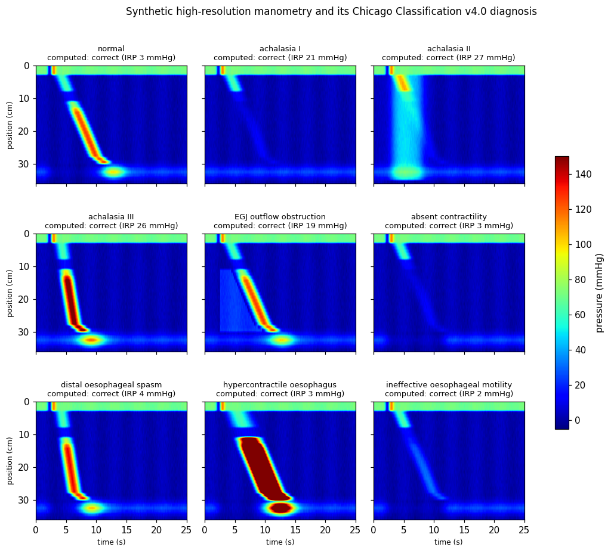
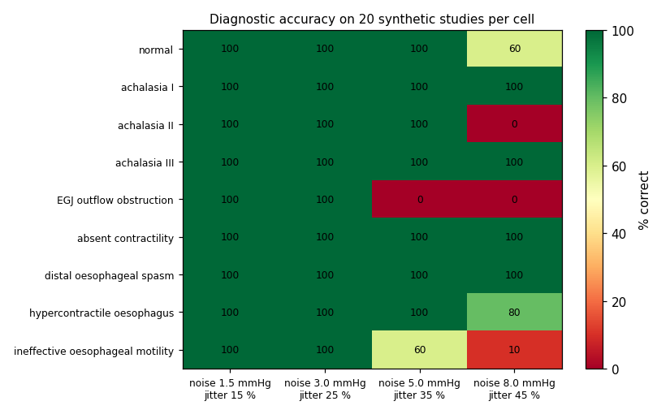

# Peristalytics

[](https://github.com/hxlvvm/Peristalytics/actions/workflows/tests.yml)

**An open Chicago Classification v4.0 engine for high-resolution oesophageal manometry, plus a labelled
synthetic benchmark to test it.**

High-resolution manometry (HRM) records pressure along the oesophagus during swallows. Clinicians diagnose
achalasia, spasm and other motility disorders from a handful of metrics: IRP, DCI, distal latency and
contraction breaks. They combine these with the Chicago Classification v4.0 (CCv4.0) decision rules.

Those metrics are normally computed by closed vendor software. `Peristalytics` provides:

1. **A metric engine** that computes the CCv4.0 metrics directly from a raw pressure array `P[t, z]`.
   - It covers IRP (4 s e-sleeve), DCI, contractile deceleration point / distal latency, the largest break
     in the 20 mmHg contour, and panesophageal pressurisation.
   - It detects the landmarks (UES relaxation, EGJ, transition zone) from the data.
2. **The CCv4.0 diagnostic hierarchy** for a 10-swallow supine study.
3. **A synthetic swallow generator** with known ground truth for every CCv4.0 phenotype. Analysis code can be
   tested against answers that are known.



## Quick start

```bash
pip install -e ".[examples,dev]"
pytest -q                         # 20 tests, a few seconds
python examples/gallery.py        # figures + robustness table
```

```python
from peristalytics import study, diagnose_study, analyse_swallow

swallows, truth = study("achalasia II", seed=0)      # ten synthetic swallows, P[t, z] in mmHg
dx = diagnose_study(swallows)
dx["diagnosis"], dx["median_irp"]                     # ('achalasia II', 26.5)
analyse_swallow(swallows[0])                          # IRP, DCI, DL, break length, pan-pressurisation
```

To analyse your own recordings, pass a pressure array sampled at 20 Hz with 1 cm sensor spacing. Rows are
time; columns run from the pharynx (0) to the stomach. Pressures are referenced to the stomach.

## How well does it work?

| check | result |
|---|---|
| DCI of a known pressure block | exact |
| IRP vs the set EGJ relaxation | within 3.5 mmHg |
| distal latency vs the set value | within 0.6 s |
| swallow typing (normal / weak / failed / fragmented / premature / hypercontractile / pressurised) | 7 of 7 |
| study diagnosis, 9 phenotypes × 10 synthetic studies | **90 of 90** |

The generator and the engine share the same assumptions, so this is a consistency check rather than a validation. The
useful number is how accuracy falls as the data get messier:

| sensor noise / swallow-to-swallow variability | 1.5 mmHg / 15 % | 3 mmHg / 25 % | 5 mmHg / 35 % | 8 mmHg / 45 % |
|---|---|---|---|---|
| mean diagnostic accuracy (20 studies per phenotype) | 100 % | 100 % | 84 % | 61 % |



Known failure modes are visible in the table:
- **EGJ outflow obstruction breaks first.** Noisy intrabolus pressure crosses the 30 mmHg contour and looks
  like premature contraction.
- **Achalasia type II needs** the whole body above 30 mmHg at once, which noise breaks.
- **Ineffective motility depends** on weak swallows staying below DCI 450.

Each of these is a concrete target for the next version, for example contour smoothing or
fractional-coverage pressurisation.

## CCv4.0 thresholds used

All values are from Yadlapati et al. 2021 (Medtronic system, supine):
- **IRP:** upper limit of normal 15 mmHg.
- **Swallow types by DCI (mmHg·s·cm):**
  - failed: below 100;
  - weak: 100 to below 450;
  - normal: 450 to 8,000;
  - hypercontractile: above 8,000.
- **Fragmented:** a break of more than 5 cm in the 20 mmHg contour, with DCI ≥ 450.
- **Premature:** distal latency below 4.5 s, with DCI ≥ 450.
- **Panesophageal pressurisation:** 30 mmHg.
- **Disorders:**
  - Achalasia I / II / III and EGJ outflow obstruction use an abnormal IRP.
  - Absent contractility is 100 % failed swallows with a normal IRP.
  - Distal oesophageal spasm needs ≥ 20 % premature swallows.
  - Hypercontractile oesophagus needs ≥ 20 % hypercontractile swallows.
  - Ineffective motility needs > 70 % ineffective swallows or ≥ 50 % failed.

## Scope and limitations

- **Not a medical device and not validated on patient recordings.** It is a research and teaching tool and
  a test bed for analysis code.
- **Supine wet swallows only.** CCv4.0 also uses upright swallows, provocation (multiple rapid swallows,
  solids) and clinical context. Its "inconclusive" and "clinically relevant" layers are not modelled.
- **The generator is phenomenological**: smooth pressure patterns with the right features, not physiology.
  For a mechanistic model of oesophageal motility, see Miura et al. 2025.

## Related work

- Yadlapati R. et al. *Esophageal motility disorders on high-resolution manometry: Chicago classification
  version 4.0.* Neurogastroenterol Motil 33:e14058, 2021.
  [doi:10.1111/nmo.14058](https://doi.org/10.1111/nmo.14058)
- Miura T. et al. *A mathematical model of human oesophageal motility function.* R Soc Open Sci 2025.
  [doi:10.1098/rsos.250491](https://doi.org/10.1098/rsos.250491)
  - A mechanistic model reproducing CCv4.0 patterns, with code.
  - `Peristalytics` is complementary: it focuses on analysing pressure data and on labelled test cases.
- Existing open repositories found while preparing this classify from metrics a user enters, or provide
  image datasets. I did not find open code that computes the metrics from raw pressure arrays.

## License

MIT
